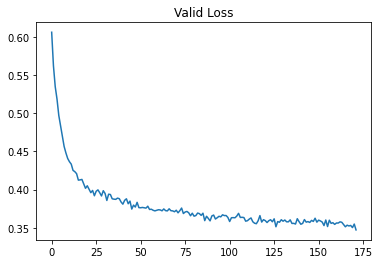
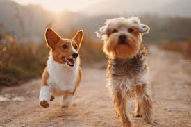
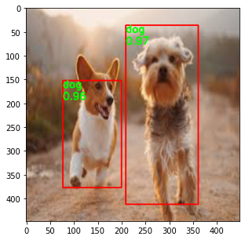
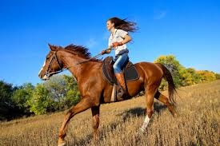
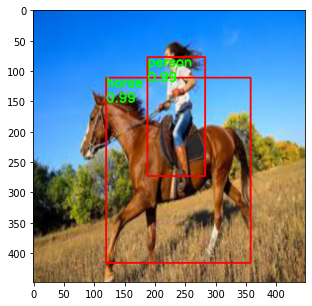
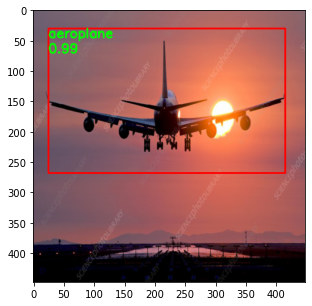
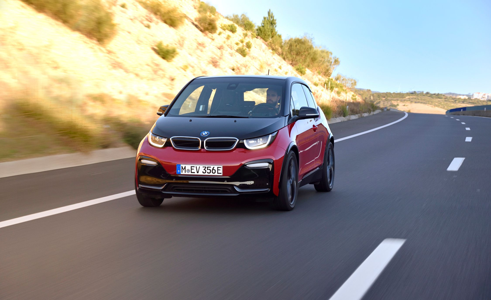
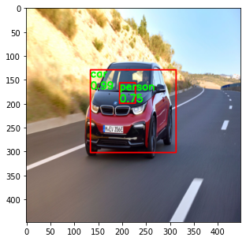
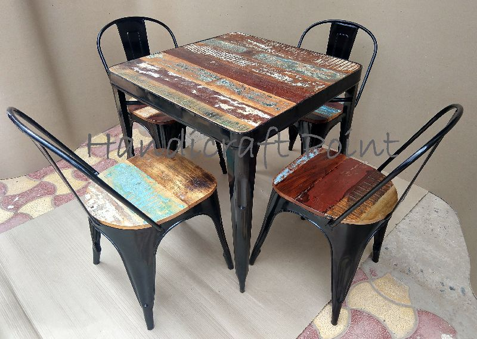
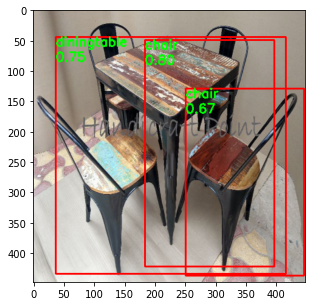

## Source Paper

This code is the implementation of paper - 

**You Only Look Once: Unified, Real-Time Object Detection** 

[Link to Paper](https://arxiv.org/abs/1506.02640)

----- 

## Training Data

PASCAL Visual Object Classes Challenge (2007) is used for training the network. 

The dataset has 20 classes for detection and recognition task. 
There are ~5000 images pertaining to these classes. ~300 images are used for validation. 

Data augmentation techniques are used  to avoid overfitting on the training set. Training data imbalance problem is not addressed. Hence, the network is biased towards some classes like person. 

------

## Network Details 

YOLO tries to solve the object detection and recognition problem as a E2E regression problem. 

Network consists of 
* Grids and Boxes
  * Each image is divided into 7 * 7 grid. Each grid has 2 boxes. 
  * If the number of classes are 20,  then the network has output of size 7 * 7 * 30. Where, each grid point has a vector of size 1 * 1 * 30. In this vector, each box has 5 values, 4 for bounding box and 1 for confidence. And each grid location has 20 values, corresponding to  20 classes. 
* Network Base
  * VGG16 architecture is used as the base of network
  * This is pre trained on image net dataset
* Network Top
  * Output from VGG16 base is passed through few conv layers. Which later goes through 2 Fully connected layer.
  * Sigmoid activation function is used on the final layer
  * The output is reshaped to 7 * 7 * 30  output tensor
* Loss
  * MSE loss is used considering all different conditions mentioned in paper

--------

## Training

Network is trained on google colab GPU. Network in not completely trained as training takes a lot of time. Getting a fully optimized model can take a longer time given that colab training disconnects / resets and there is a usage limit on colab. 

A training batch of 8 images is used.

----

## Training Loss 

Training loss per 10 iterations is stored. Here is the graph. 

It is mentioned in paper - `MSE loss has to be applied on square roots of predicted normalized width and height.` But this is not implemented in this code. Simply MSE loss of normalized width and height is used. 

---- 

## Validation Loss

After each epoch, average validation loss for the validation set is calculated. Here is the graph.

The validation loss is still decreasing. Hence, the network can give better predictions if trained for more time. 

## Detection Demo Images 

Network is tested on random images downloaded form Internet. The predictions still need improvement. More training, addressing the problem for data imbalance and better data augmentation techniques can be used to solve the problem. Here are the results on some chosen sample images from web.

Input Image             |  Predictions
:-------------------------:|:-------------------------:
  |  
  |  
  |  
  |  
  |  
  |  

